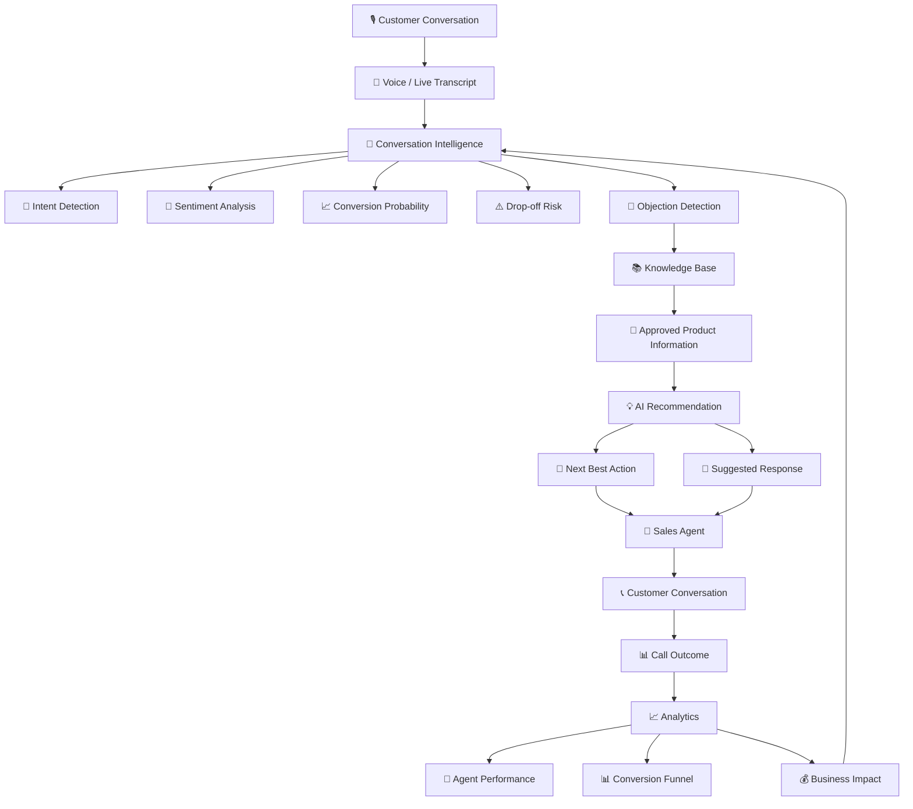

<div align="center">


</div>

<div align="center">


</div>

<h3 align="center">🚀 A real-time AI sales co-pilot that listens to customer conversations, detects objections, recommends the next best action, and helps inside-sales teams convert more Pay-in-3 opportunities.</h3>

<p align="center">
For inside-sales teams, SalesAI Co-Pilot combines live conversation intelligence, objection detection, grounded product knowledge, AI recommendations, and sales analytics in one workspace — helping agents respond faster while giving managers visibility into what drives conversion.
</p>

<div align="center">

<a href="#-quick-start"></a>
<a href="#-architecture"></a>
<a href="#-features"></a>

</div>

## 📌 Table of Contents

- [The Problem](#-the-problem)
- [Purpose & Philosophy](#-purpose--philosophy)
- [Architecture](#-architecture)
- [Features](#-features)
- [Tech Stack](#-tech-stack)
- [Quick Start](#-quick-start)
- [Environment Config](#-environment-config)
- [Product Workflow](#-product-workflow)
- [Voice Co-Pilot](#-voice-co-pilot)
- [Knowledge Base](#-knowledge-base)
- [Use Cases](#-use-cases)
- [Project Structure](#-project-structure)
- [Results & Product Metrics](#-results--product-metrics)
- [Troubleshooting](#-troubleshooting)
- [Roadmap](#-roadmap)
- [What's Next](#-whats-next)
- [Screenshots](#-screenshots)
- [Contributing](#-contributing)
- [License](#-license)

---

## 🧨 The Problem

Inside-sales representatives selling Pay-in-3 products have to listen, understand customer intent, handle objections, find accurate product information, and close the conversation — often at the same time.

| Sales Challenge | Impact |
|---|---|
| Affordability Objections | Customers hesitate when the purchase amount feels high |
| Fee Questions | Agents need accurate pricing information immediately |
| KYC Concerns | Customers may hesitate to complete verification |
| Trust Concerns | Inconsistent answers can reduce customer confidence |
| Timing Objections | Customers postpone decisions and conversion opportunities are lost |
| Scattered Product Information | Agents lose valuable call time searching for answers |
| Limited Call Visibility | Managers see outcomes but not always the reason behind them |
| Manual Post-Call Analysis | Teams spend time reviewing conversations after the call |

Traditional sales assistance looks like:

```
Customer
   ↓
Sales Agent
   ↓
Listen
   ↓
Understand Objection
   ↓
Search Product Information
   ↓
Think of Response
   ↓
Respond
   ↓
Hope for Conversion
```

SalesAI Co-Pilot changes this into:

```
Customer Conversation
        ↓
Conversation Intelligence
        ↓
Objection Detection
        ↓
Knowledge Retrieval
        ↓
Next Best Action
        ↓
Suggested Response
        ↓
Sales Agent
        ↓
Customer Outcome
        ↓
Analytics
```

---

## 🎯 Purpose & Philosophy

SalesAI Co-Pilot is designed as a real-time decision-support layer for sales representatives — not a replacement for the human agent.

- 🎙️ **Voice-first** — designed around the live customer conversation.
- 🧠 **Context-aware** — understands intent, sentiment, conversion probability, and drop-off risk.
- 🚨 **Objection-driven** — focuses AI assistance on the customer's biggest blocker.
- 📚 **Grounded** — uses approved product information for sales guidance.
- 💡 **Action-oriented** — recommends what the agent should do next.
- 📊 **Measurable** — connects AI assistance with sales outcomes and analytics.
- 🛡️ **Controlled** — supports approved language and compliance-oriented workflows.
- 👤 **Human-in-the-loop** — the salesperson remains in control of the final response.

> Listen → Understand → Detect → Recommend → Respond → Convert → Measure

---

## 🏗️ Architecture



### Architecture Layers

| Layer | Responsibility |
|---|---|
| Presentation Layer | Dashboard, Live Call, Analytics, Knowledge Base |
| Conversation Layer | Voice/call workflow and live transcript |
| Intelligence Layer | Intent, sentiment, conversion probability and risk |
| Objection Layer | Detects affordability, fees, KYC, trust and timing objections |
| Knowledge Layer | Provides approved Pay-in-3 product information |
| Recommendation Layer | Generates next-best-action and response guidance |
| Analytics Layer | Measures calls, conversion, objections, agents and business impact |

### Core Decision Flow

```
Customer speaks
      ↓
Capture conversation
      ↓
Understand context
      ↓
Detect intent / sentiment / risk
      ↓
Detect objection
      ↓
Retrieve approved knowledge
      ↓
Recommend next action
      ↓
Suggest response
      ↓
Sales agent responds
      ↓
Measure outcome
```

---

## ✨ Features

| Module | Capability | Primary User |
|---|---|---|
| 🎙️ Live Call | Real-time sales workspace with conversation context and AI assistance | Sales Agent |
| 🧠 Conversation Intelligence | Intent, sentiment, conversion probability and drop-off risk | Sales Agent |
| 🚨 Objection Detection | Detects affordability, fees, KYC, trust and timing objections | Sales Agent |
| 💡 AI Recommendation | Recommends the next best action | Sales Agent |
| 💬 Suggested Response | Provides contextual response guidance | Sales Agent |
| 📚 Knowledge Base | Product, pricing, FAQ, KYC and compliance information | Sales Agent |
| 📊 Sales Dashboard | KPIs, funnel, calls, conversion and objection overview | Manager |
| 📈 Analytics | Agent performance, AI acceptance and conversion analysis | Manager |
| 💰 Business Impact | AI-assisted sales and estimated ROI visualization | Manager |
| 🛡️ Compliance Support | Approved language, prohibited claims and knowledge versioning | Sales / Compliance |

---

## 🧰 Tech Stack

| Layer | Technology |
|---|---|
| Frontend Framework | Next.js 14 |
| Language | TypeScript |
| UI | React |
| Styling | Tailwind CSS |
| Database / Data Layer | Supabase + PostgreSQL |
| Application Logic | React Hooks + TypeScript |
| Voice Experience | Browser-based voice/call workflow |
| Analytics | Interactive dashboard visualizations |
| Package Manager | npm |
| Version Control | Git + GitHub |
| Deployment Configuration | Netlify |

---

## 🚀 Quick Start

### Prerequisites

- Node.js
- npm
- Git
- Modern web browser
- Supabase project for connected data functionality

### Step 1 — Clone

```bash
git clone <YOUR_GITHUB_REPOSITORY_URL>
cd <YOUR_PROJECT_DIRECTORY>
```

### Step 2 — Install Dependencies

```bash
npm install
```

### Step 3 — Configure Environment

Create:

```
.env.local
```

Add the required values:

```env
NEXT_PUBLIC_SUPABASE_URL=your_supabase_url
NEXT_PUBLIC_SUPABASE_ANON_KEY=your_supabase_anon_key
```

### Step 4 — Run

```bash
npm run dev
```

Open:

```
http://localhost:3000
```

### Step 5 — Production Build

```bash
npm run build
```

### Step 6 — Start Production Server

```bash
npm start
```

---

## 🔧 Environment Config

Example:

```env
# ── Supabase ─────────────────────────────────────────────
NEXT_PUBLIC_SUPABASE_URL=your_supabase_project_url
NEXT_PUBLIC_SUPABASE_ANON_KEY=your_supabase_anon_key
```

### Security

Never commit:

```
.env
.env.local
.env.production
```

Never expose secret credentials in client-side code.

---

## 🔄 Product Workflow

```
┌────────────────────────────┐
│      Customer Call         │
└─────────────┬──────────────┘
              ↓
┌────────────────────────────┐
│     Live Conversation      │
└─────────────┬──────────────┘
              ↓
┌────────────────────────────┐
│ Conversation Intelligence  │
│                            │
│ Intent                     │
│ Sentiment                  │
│ Conversion Probability     │
│ Drop-off Risk              │
└─────────────┬──────────────┘
              ↓
┌────────────────────────────┐
│    Objection Detection     │
└─────────────┬──────────────┘
              ↓
┌────────────────────────────┐
│       Knowledge Base       │
└─────────────┬──────────────┘
              ↓
┌────────────────────────────┐
│     AI Recommendation      │
│                            │
│ Next Best Action           │
│ Suggested Response         │
└─────────────┬──────────────┘
              ↓
┌────────────────────────────┐
│       Sales Agent          │
└─────────────┬──────────────┘
              ↓
┌────────────────────────────┐
│      Customer Outcome      │
└─────────────┬──────────────┘
              ↓
┌────────────────────────────┐
│ Analytics & Business Impact│
└────────────────────────────┘
```

---

## 🎙️ Voice Co-Pilot

The Live Call workspace is the central experience of the platform.

It combines:

- Customer profile
- Live transcript
- Conversation state
- Intent
- Sentiment
- Conversion probability
- Drop-off risk
- Objection detection
- AI confidence
- Next-best action
- Suggested response

### Example

```
Customer:
"I'm interested, but Rs. 9,000 is expensive."

             ↓

Detected Objection:
AFFORDABILITY

             ↓

AI Recommendation:
Explain Pay-in-3 Payment Structure

             ↓

Suggested Response:
Use approved Pay-in-3 product language
to explain the payment structure.

             ↓

Sales Agent:
Continues the conversation
```

The AI acts as a co-pilot, while the salesperson remains responsible for the final customer interaction.

---

## 🚨 Objection Intelligence

Supported demo objection categories:

| Objection | Example |
|---|---|
| 💳 Affordability | "Rs. 9,000 is expensive." |
| 💰 Fees | "Are there any additional charges?" |
| 🔐 KYC | "Why do you need my documents?" |
| 🛡️ Trust | "Is this service safe?" |
| ⏱️ Timing | "Can I decide later?" |

### Objection → Action

```
Customer statement
       ↓
Objection classification
       ↓
Objection category
       ↓
Knowledge retrieval
       ↓
AI recommendation
       ↓
Next best action
       ↓
Suggested response
```

> The important distinction is: the system does not stop at detecting an objection — it connects the objection to an actionable sales response.

---

## 📚 Knowledge Base

The Knowledge Base provides structured product information for grounded sales assistance.

### Categories

- 📦 Product Information
- ✅ Eligibility
- 🔐 KYC
- ❓ FAQs
- 💬 Approved Language
- 🚫 Prohibited Claims
- 💰 Pricing
- 🛡️ Compliance

### Knowledge Version

**Pay-in-3 Knowledge v2.1**
Effective: Jan 15, 2025

### Grounded Response Flow

```
Customer Question
       ↓
Intent / Objection Detection
       ↓
Knowledge Retrieval
       ↓
Approved Information
       ↓
AI Recommendation
       ↓
Suggested Response
       ↓
Sales Agent
```

---

## 📊 Sales Dashboard

The Dashboard provides a high-level view of sales performance.

### Demo KPIs

| Metric | Demo Value |
|---|---|
| Calls Analyzed | 33 |
| Conversion Rate | 57.6% |
| AI-Assisted | 57.6% |
| Drop-off Rate | 33.3% |
| AI Cost / Call | Rs. 11.32 |
| Top Objection | Affordability |

*These values are illustrative demo data displayed by the application.*

### Conversion Funnel

```
Call Connected
      ↓
Engaged
      ↓
Objections Resolved
      ↓
Intent to Onboard
      ↓
Converted
```

---

## 📈 Analytics

Analytics connects conversation-level intelligence with sales-level performance.

### AI Metrics

| Metric | Demo Value |
|---|---|
| AI Recommendation Acceptance | 41% |
| Total Objections Detected | 25 |
| Average AI Cost / Call | Rs. 12.83 |
| Estimated Revenue Lift | +57% |

### Agent Performance

The platform can compare:

- Total calls
- Converted calls
- Conversion rate
- AI recommendation acceptance

Example demo view:

```
Agent Priya
19 calls
17 converted
89% conversion

Agent Rohit
15 calls
2 converted
13% conversion
```

---

## 💰 Business Impact

The platform connects AI assistance with estimated commercial impact.

```
                 SALES PERFORMANCE

              WITHOUT AI
                  │
                  ▼
           Baseline Conversion
                  │
                  ▼
                WITH AI
                  │
                  ▼
          AI-Assisted Conversion
                  │
             ┌────┴────┐
             ↓         ↓
          Revenue    AI Cost
             │         │
             └────┬────┘
                  ↓
                 ROI
```

### Demo Metrics

| Metric | Value |
|---|---|
| AI Cost / Call | Rs. 12.83 |
| Revenue / Conversion | Rs. 2,400 |
| Estimated Net ROI | 18,600% |

*These figures are illustrative demo metrics and are not independently validated financial projections.*

---

## 💼 Use Cases

### 🏪 Inside Sales Teams

Sales representatives receive contextual assistance during live customer conversations.

```
Customer
   ↓
Conversation
   ↓
Objection
   ↓
AI Recommendation
   ↓
Agent Response
   ↓
Outcome
```

### 🏢 Sales Managers

Managers can monitor:

- Conversion rate
- Drop-off rate
- Objection trends
- Agent performance
- AI recommendation acceptance
- Business impact

### 💳 Pay-in-3 Product Teams

Product teams can identify:

- Common customer objections
- Conversion bottlenecks
- Customer concerns
- Agent performance
- AI-assisted conversion trends

### 🎓 Hackathon / Portfolio

The project demonstrates a complete applied-AI workflow:

```
VOICE
 ↓
UNDERSTAND
 ↓
DETECT
 ↓
RETRIEVE
 ↓
RECOMMEND
 ↓
ACT
 ↓
CONVERT
 ↓
MEASURE
```

---

## 📁 Project Structure

```
SalesAI-Co-Pilot/
├── 📁 app/
│   ├── ...                         # Next.js application routes/pages
│
├── 📁 components/
│   ├── ...                         # Reusable React components
│
├── 📁 hooks/
│   ├── ...                         # Custom React hooks
│
├── 📁 lib/
│   ├── ...                         # Shared utilities and logic
│
├── 📁 supabase/
│   └── 📁 migrations/              # Database migrations
│
├── 📁 public/
│   └── ...                         # Static assets
│
├── 📄 .eslintrc.json
├── 📄 .gitignore
├── 📄 README.md
├── 📄 components.json
├── 📄 netlify.toml
├── 📄 next.config.js
├── 📄 package.json
├── 📄 package-lock.json
├── 📄 postcss.config.js
├── 📄 tailwind.config.ts
└── 📄 tsconfig.json
```

---

## 📈 Results & Product Metrics

The application demonstrates an analytics layer connecting AI assistance with sales outcomes.

### Sales Metrics

| Metric | Value |
|---|---|
| Calls Analyzed | 33 |
| Conversion Rate | 57.6% |
| AI-Assisted Calls | 57.6% |
| Drop-off Rate | 33.3% |
| AI Cost / Call | Rs. 11.32 |
| Top Objection | Affordability |

### AI Metrics

| Metric | Value |
|---|---|
| Recommendation Acceptance | 41% |
| Objections Detected | 25 |
| Average AI Cost / Call | Rs. 12.83 |
| Estimated Revenue Lift | +57% |

### Business Impact

| Metric | Value |
|---|---|
| Revenue / Conversion | Rs. 2,400 |
| Estimated Net ROI | 18,600% |

> **Note:** All metrics in this section are illustrative/demo values shown by the application and should not be interpreted as independently validated production results.

---

## 🧯 Troubleshooting

| Symptom | Likely Cause | Fix |
|---|---|---|
| `npm` is not recognized | Node.js/npm not installed | Install Node.js and restart terminal |
| Module not found | Dependencies missing | Run `npm install` |
| `npm run dev` fails | Configuration/dependency issue | Reinstall dependencies |
| Supabase connection fails | Incorrect environment variables | Check `.env.local` |
| Hydration error | Server/client content mismatch | Avoid unstable client-generated values during SSR |
| Voice unavailable | Browser microphone permission denied | Allow microphone access |
| Build fails | TypeScript/ESLint issue | Run `npm run build` |
| Port already in use | Another process uses port 3000 | Stop process or use another port |

### Windows PowerShell Clean Install

```powershell
Remove-Item -Recurse -Force node_modules
Remove-Item package-lock.json
npm install
npm run dev
```

---

## 🗺️ Roadmap

- [x] Sales Dashboard
- [x] Live Call Workspace
- [x] Conversation Intelligence
- [x] Objection Detection
- [x] AI Recommendation UI
- [x] Knowledge Base
- [x] Analytics Dashboard
- [x] Business Impact Dashboard
- [x] Voice-oriented call workflow
- [x] Production-grade speech-to-text
- [x] Real-time streaming transcription
- [x] Speaker diarization
- [x] Advanced RAG pipeline
- [x] Conversation memory
- [x] Response source citations
- [x] Automated AI evaluation
- [x] CRM integrations
- [x] Agent coaching
- [x] Team benchmarking
- [x] Role-Based Access Control
- [x] Multi-language voice AI
- [x] Production observability
- [x] Real-time WebSocket dashboard

---

## 🔭 What's Next?

### 🚀 Immediate Production Improvements

| Task | Description |
|---|---|
| Real-Time Voice Pipeline | Low-latency streaming speech-to-text and conversation processing |
| Advanced RAG | Dynamically retrieve approved product information |
| CRM Integration | Connect AI conversation intelligence with existing sales systems |
| Agent Coaching | Identify sales coaching opportunities automatically |
| Observability | Monitor latency, failures, AI quality and cost |
| RBAC | Separate agent, manager and administrator capabilities |
| Audit System | Track recommendations, knowledge versions and outcomes |

### 🔬 Future AI Enhancements

| Feature | Why It Matters |
|---|---|
| Multilingual Voice AI | Support customers across Indian languages |
| Conversation Memory | Maintain context throughout longer calls |
| Adaptive Recommendations | Personalize recommendations based on customer behaviour |
| Predictive Drop-off Detection | Identify customers likely to abandon earlier |
| Automated Call Summaries | Reduce post-call administrative work |
| AI Agent Coaching | Improve salesperson performance |
| AI Evaluation Framework | Continuously measure grounding and recommendation quality |

### 🌐 Scaling & Resilience

A production version can evolve toward:

```
                         ┌──────────────────┐
                         │   Load Balancer  │
                         └────────┬─────────┘
                                  │
                   ┌──────────────┴──────────────┐
                   ↓                             ↓
          ┌─────────────────┐          ┌─────────────────┐
          │   Next.js App   │          │   Voice Layer   │
          └────────┬────────┘          └────────┬────────┘
                   │                            │
                   └─────────────┬──────────────┘
                                 ↓
                       ┌───────────────────┐
                       │  AI Orchestrator  │
                       └─────────┬─────────┘
                                 │
              ┌──────────────────┼──────────────────┐
              ↓                  ↓                  ↓
       ┌────────────┐     ┌────────────┐     ┌────────────┐
       │ Knowledge  │     │ Analytics  │     │ AI Models  │
       │    Base    │     │  Database  │     │            │
       └────────────┘     └────────────┘     └────────────┘
```

Potential production improvements:

- Horizontal scaling
- Database optimization
- Intelligent caching
- Queue-based processing
- WebSocket streaming
- Centralized logging
- AI latency monitoring
- Automated health checks
- Failure recovery
- Secure authentication
- Role-based authorization

---

## 🛡️ Security & Compliance

### Current Demo Safeguards

- Customer phone information is masked.
- Customer information is presented as synthetic/demo data.
- Product guidance is organized around approved knowledge.
- Prohibited claims are separated from approved language.
- Knowledge content is versioned.
- Compliance information is surfaced in the Knowledge Base.

### Production Checklist

- [x] Authentication
- [x] Role-Based Access Control
- [x] Encryption in Transit
- [x] Encryption at Rest
- [x] Secrets Management
- [x] PII Masking
- [x] Data Retention Policy
- [x] Call Recording Consent
- [x] Audit Logging
- [x] AI Safety Evaluation
- [x] Knowledge Versioning
- [x] Response Traceability
- [x] Monitoring & Alerting
- [x] Load Testing
- [x] Disaster Recovery

---

## 📸 Screenshots

**Sales Dashboard**


**Live Call — Voice Co-Pilot**


**Analytics**


**Knowledge Base**


---

## 📚 For Contributors — Extending the Platform

To add a new feature:

1. Create reusable UI components in `components/`
2. Add shared logic in `lib/`
3. Add reusable client logic in `hooks/`
4. Add routes/pages in `app/`
5. Add database changes in `supabase/migrations/`
6. Run the production build with `npm run build`
7. Test the complete user flow before opening a PR

### Contribution Guidelines

- Keep components reusable.
- Keep business logic separated from UI.
- Avoid unsupported financial claims.
- Keep demo customer data synthetic.
- Preserve Knowledge Base grounding.
- Never commit secrets.
- Keep AI recommendations explainable.
- Validate new features before merging.


## ⭐ Project Highlights

```
🎙️ Voice-First Sales Experience
              +
🧠 Conversation Intelligence
              +
🚨 Real-Time Objection Detection
              +
📚 Grounded Knowledge Base
              +
💡 Next-Best-Action Recommendations
              +
📊 Sales Analytics
              +
👥 Agent Performance
              +
💰 Business Impact Measurement
```

### One-Line Pitch

> SalesAI Co-Pilot turns live customer conversations into real-time, grounded, actionable sales intelligence — helping sales agents handle objections faster and convert more opportunities.

---

## 📜 License

Add your preferred project license here.

---

<div align="center">

### 🎙️ SalesAI Co-Pilot

**Listen Better. Respond Faster. Convert Smarter.**

AI-powered voice intelligence for Pay-in-3 inside sales.

Built with Next.js, TypeScript, React, Tailwind CSS and Supabase.

</div>


